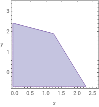
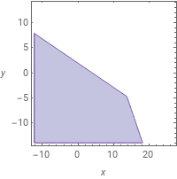

# 1538G : Gift Set

## Tóm tắt
> Ta có $R$ kẹo đỏ và $B$ kẹo xanh. Ta có thể tạo một gọi quà bằng $a$ kẹo đỏ và $b$ kẹo xanh hoặc $b$ kẹo xanh và $a$ kẹo đỏ. 
>
> Yêu cầu: tìm số gói quà nhiều nhất cỏ thể tạo được.

## Hướng giải
[Solution](https://codeforces.com/blog/entry/91637) chính thức của bài này là chặt nhị phân trên đáp án (nếu ta có thể tạo $x$ gói quà ta cũng có thể tạo ra $y < x$ gói quà). 

Tuy vậy nếu bạn chưa nhìn ra nhận xét này, bạn có thể xây dựng một hệ bất phương trình thỏa mãn yêu cầu đề và tìm trực tiếp cách chọn quà tối ưu.

## Lời giải
Dễ thấy ta có thể viết lại số cách chọn gói quà dưới dạng một hệ bất phương trình:

$$

\left\{\begin{matrix}
ax + by \leq R
\\ 
bx + ay \leq B
\end{matrix}\right.
$$

Trong đó $x$ là số gói quà chứa $a$ kẹo đỏ và $b$ kẹo xanh và $y$ là số gói quà chứa $a$ kẹo đỏ và $b$ kẹo xanh.

Do đó kết quả cần tìm là giá trị $x+y$ lớn nhất với mọi $x$, $y$ thỏa mãn hệ bất phương trình trên.

Tới đây, khi nhìn vào [miền nghiệm](https://www.wolframalpha.com/input?i2d=true&i=5x+%2B+2y+%3C%3D+10+and+2x+%2B+5y+%3C%3D+12) của test đề bài:



Ta có thể đoán rằng $x+y$ lớn nhất sẽ xảy ra tại giao điểm hai đường thẳng $ax+by-R$ và $bx-ay-B$.

**Lưu ý:** thực tế hệ bất phương trình của ta còn thiếu hai điều kiện là $x \geq 0$ và $y \geq 0$.

Ví dụ với $R = 52$, $B = 311$, $a = 13$, $b = 27$ ta có miền nghiệm như sau: 



Tại đây, giao điểm của hai đường thẳng là điểm $(13.7875, -4.7125)$ nên không thể lấy hai điểm có tọa độ nguyên gần nó nhất.

Vậy ta cần xét tới trường hợp các đường thẳng giao với hai trục $Ox$, $Oy$ (khi $y= 0$ hoặc $x = 0$)

Tóm lại, ta cần tìm điểm $I$ là giao điểm của hai trong bốn đường thẳng
- $Ox$
- $Oy$
- $d1 = ax+by-R$
- $d2 = bx+ay-B$

và kiểm tra xem $I$ có cả hoành độ và tung độ dương.

Kết quả là $x+y$ lớn nhất của mọi $I(x,y)$ có $x$ và $y$ là số nguyên.

## Cài đặt

Để tìm giao điểm hai đường thẳng ta có thể dùng [quy tắc Crammer](https://en.wikipedia.org/wiki/Cramer%27s_rule#Explicit_formulas_for_small_systems): 

Khi tìm được tọa độ điểm $I$ ta sẽ làm tròn chúng và kiểm tra các số nguyên gần nhất để xét.

<details>
  <summary> Code của mình: </summary>

```cpp
#include <bits/stdc++.h>
using namespace std;
using ll = long long;
using ld = long double;

struct pt {
    ld x, y;
};

struct line {
    ld a, b, c;
};

const ld EPS = 1e-9;

ld det(ld a, ld b, ld c, ld d) {
    return a*d - b*c;
}

bool intersect(line m, line n, pt & res) {
    ld zn = det(m.a, m.b, n.a, n.b);
    if (abs(zn) < EPS)
        return false;
    res.x = -det(m.c, m.b, n.c, n.b) / zn;
    res.y = -det(m.a, m.c, n.a, n.c) / zn;
    return true;
}

void solve() {
    ld R, B, a, b;
    cin >> R >> B >> a >> b;

    // ax + by <= R
    // bx + ay <= B

    line Ox = {1, 0, 0};
    line Oy = {0, 1, 0};

    line d1 = {a, b, -R};
    line d2 = {b, a, -B};

    vector<line> li = {Ox, Oy, d1, d2};

    vector<pt> coord;

    for (int i = 0; i < 4; i++) {
        for (int j = i+1; j < 4; j++) {
            pt insec;
            intersect(li[i], li[j], insec);

            if (insec.x >= 0 && insec.y >= 0) {
                coord.push_back(insec);
            }
        }
    }

    ll res = 0;
    for (auto &[x, y] : coord) {
        for (ll dx = -2; dx <= 2; dx++) {
            for (ll dy = -2; dy <= 2; dy++) {
                ll x0 = (ll) round(x) + dx;
                ll y0 = (ll) round(y) + dy;

                if (x0 < 0 || y0 < 0) continue;
                if (a*x0 + b*y0 <= R && b*x0 + a*y0 <= B) {
                    res = max(res, x0 + y0);
                }
            }
        }
    }

    cout << res << endl;
}

int main() {
    ios_base::sync_with_stdio(0);
    cin.tie(0);
    int t = 1;
    cin >> t;
    while (t--) solve();
}
```
</details>
